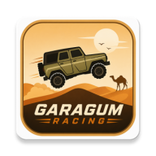

<div align="center">



# 🏜️ Garagum Racing

**A 2D physics-based hill-climb racing game set in the sands of Turkmenistan**

Conquer sand dunes, collect coins, manage your fuel — race through 55 stages across 4 unique maps!

<br/>


</div>

---

## 📖 Table of Contents

- [About the Game](#-about-the-game)
- [Features](#-features)
- [Maps](#️-maps)
- [Vehicles](#-vehicles)
- [Game Mechanics](#-game-mechanics)
- [Monetization](#-monetization)
- [Tech Stack](#-tech-stack)
- [Project Structure](#-project-structure)
- [Getting Started](#-getting-started)
- [Release Configuration](#-release-configuration)

---

## 🎮 About the Game

**Garagum Racing** is a 2D physics-based hill-climb racing game inspired by the landscapes of Turkmenistan. Players navigate through sweeping desert dunes, jagged cliffs, and blazing gas craters, collecting coins along the way while managing fuel to reach the finish line.

The game is powered by the **Flame** engine and **Forge2D** physics simulation, featuring an authentic 3-layer dynamic engine audio model.

---

## ✨ Features

| | |
|---|---|
| 🏜️ **4 Thematic Maps** | Garagum, Ashgabat, Yangykala, Darvaza — each with unique visuals, obstacles, and soundtracks |
| 🚙 **4 Distinct Vehicles** | Buggy, UAZ, Pickup, White Car — each with unique engine power, suspension, tires, and fuel capacity |
| 🪙 **Coin Economy** | Collect coins on the road, unlock new stages, and purchase vehicles |
| ⛽ **Fuel Mechanics** | Conserve fuel and pick up gas cans along the track — run out of fuel and the run is over |
| 🏁 **55 Stages** | Progressively challenging stages distributed across all maps |
| 🎵 **Dynamic Audio** | 3-layer engine sound system (idle / mid / rev) blended dynamically by speed |
| 💰 **Monetization** | AdMob advertisements + RevenueCat in-app purchases & subscriptions |
| 💾 **Local Persistence** | Coins and stage progress saved locally via `SharedPreferences` |

---

## 🗺️ Maps

| Map | Description | Stages |
|---|---|:---:|
| 🏜️ **Garagum Desert** | Sweeping sands, rolling dunes, and canal bridges | 10 |
| 🏛️ **Ashgabat** | White marble avenues and monumental architecture | 15 |
| 🪨 **Yangykala** | Steep rock formations and canyon passages | 15 |
| 🔥 **Darvaza (Gas Crater)** | Night race with open flames and trap hazards (headlights engaged) | 15 |

---

## 🚙 Vehicles

| Vehicle | Engine | Fuel Tank | Characteristics |
|---|:---:|:---:|---|
| 🏎️ **Buggy** | ★★☆☆☆ | ★★☆☆☆ | Lightweight and agile starter vehicle |
| 🚙 **UAZ** | ★★★☆☆ | ★★★★☆ | Well-balanced with a large fuel capacity for long distances |
| 🛻 **Pickup** | ★★★★☆ | ★★★★☆ | High-torque engine, excellent on rough and steep terrain |
| 🚗 **White Car** | ★★★☆☆ | ★★★☆☆ | Nimble cruiser optimized for urban tracks |

> Vehicle properties (`engine`, `suspension`, `tires`, `fuel`) directly tune the physics behavior in `lib/models/vehicle_config.dart`.

---

## 🎯 Game Mechanics

### Fuel ⛽
- The engine consumes fuel continuously; consumption increases during acceleration and braking.
- When fuel drops below **25%**, a warning appears and a fuel can spawns ahead.
- Completely exhausting the fuel tank brings up the **"Out of Fuel"** screen (players can watch a rewarded ad to continue).

### Coins 🪙
- Collect coins scattered along the route; each stage requires a **target coin count** to clear.
- All collected coins are added to your balance (persisted even upon crash or failure).

### Stages 🏁
- Cross the finish line **and** collect the required coins to complete the stage and unlock the next one.
- Each map tracks its stage progress independently.

---

## 💰 Monetization

The game pairs **AdMob** (advertising) with **RevenueCat** (in-app purchases & subscriptions), carefully balanced to provide a player-friendly experience.

### 📺 Advertisements (AdMob)

| Type | Placement | Rules |
|---|---|---|
| 🎁 **Rewarded** — Continue | Out of fuel prompt | Watch ad → refuels tank (once per run) |
| 🎁 **Rewarded** — 2× Coins | Results screen | Watch ad → doubles earned coins (once per run) |
| 📺 **Interstitial** | Navigating back to menu/levels after a run | None during first 5 runs, then every 3rd run |
| 🏷️ **Banner** | Main menu and garage only | Never shown during active gameplay |

### 🛒 In-App Purchases (RevenueCat)

| Entitlement | Benefits |
|---|---|
| `no_ads` | Removes banner + interstitial ads (**rewarded ads remain available**) |
| `unlock_all_maps` | Instantly unlocks all maps |
| `vip` | Ad-free + daily coin bonuses + permanent 2× coin multiplier + VIP car colors |

> Players with **no-ads** can still choose to watch rewarded ads for optional bonus rewards.
> Paywalls can be customized remotely without updating the app using **RevenueCat Paywalls v2**.

---

## 🛠️ Tech Stack

| Layer | Technology |
|---|---|
| **Framework** | Flutter (Dart) |
| **Game Engine** | [Flame](https://flame-engine.org/) `1.35` |
| **Physics Engine** | Forge2D (`flame_forge2d`) |
| **Audio** | `flame_audio` (3-layer engine sound model) |
| **Persistence** | `shared_preferences` |
| **Ads** | `google_mobile_ads` |
| **In-App Purchases** | `purchases_flutter` + `purchases_ui_flutter` |

**State Management:** Clean `setState` + `ValueNotifier` architecture (no heavy external state packages).
**Services:** `GameProgressService`, `PurchaseService`, `AdService` — implemented as singletons initialized once in `main()`.

---

## 📁 Project Structure

```
lib/
├── main.dart                     # App entry point — initializes core services
├── game/
│   ├── garagum_racing_game.dart  # Main Flame game loop (physics, fuel, camera)
│   ├── audio/audio_manager.dart  # 3-layer engine audio + SFX management
│   ├── components/               # Vehicle, coins, gas cans, obstacles
│   └── world/                    # Ground, bridges, parallax backgrounds, decor (per map)
├── models/
│   ├── map_theme.dart            # 4 map themes enum & metadata
│   ├── round_config.dart         # Stage configurations for all 55 stages
│   └── vehicle_config.dart       # Tuning specs for the 4 vehicles
├── screens/
│   ├── menu/                     # Main menu & settings
│   ├── garage/                   # Vehicle selection & garage
│   ├── levels/                   # Stage selection (per map)
│   ├── race_screen.dart          # Active race view & HUD overlays
│   └── game_over/                # Game over screen
├── services/
│   ├── game_progress_service.dart# Coins & stage progression (SharedPreferences)
│   ├── purchase_service.dart     # RevenueCat integration (entitlements, paywalls)
│   └── ad_service.dart           # AdMob integration (banner, interstitial, rewarded)
└── widgets/
    └── ad_banner.dart            # Self-managing banner widget
```

---

## 🚀 Getting Started

### Prerequisites
- Flutter SDK `3.10+` (tested on `3.38`)
- Android Studio / Xcode (for device or emulator testing)

### Installation & Running

```bash
# Install dependencies
flutter pub get

# Run on a connected device or emulator
flutter run

# Build release APK (Android)
flutter build apk --release
```

> ⚠️ **Note:** Ads and in-app purchases function exclusively on **physical Android/iOS devices** (not web/desktop). Test IDs are pre-configured to display "Test Ad" banners.

---

## 🔑 Release Configuration

Before publishing to production, replace the **test IDs** with live credentials:

| File | Configuration Target |
|---|---|
| `lib/services/purchase_service.dart` | `_androidApiKey` / `_iosApiKey` → RevenueCat public API keys |
| `lib/services/ad_service.dart` | Banner / interstitial / rewarded ad unit IDs |
| `android/app/src/main/AndroidManifest.xml` | AdMob **App ID** meta-data |
| `ios/Runner/Info.plist` | `GADApplicationIdentifier` + `SKAdNetworkItems` |

Ensure the following entitlements and products are configured in the **RevenueCat Dashboard**:
`no_ads`, `unlock_all_maps`, `vip` + coin packs (`coins_10000`, `coins_50000`, `coins_200000`).

---

<div align="center">

**Garagum Racing** 🏜️ — Race across the sands of Turkmenistan!

<sub>Built with Flutter · Flame · Forge2D</sub>

</div>
